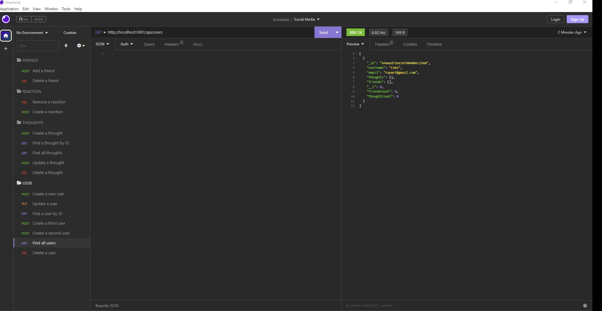
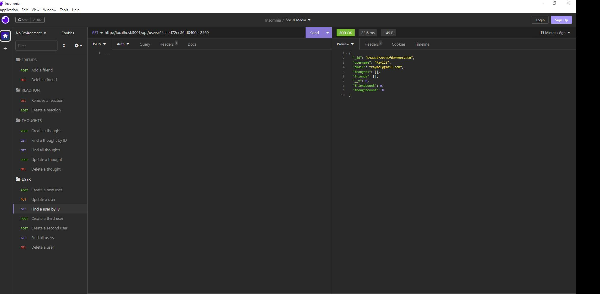

# Social Network API
 
## Table of Contents:
  - [Description](#description)
  - [Usage](#usage)
  - [Installation](#installation)
  - [Tests](#tests)
  - [License](#license)
  - [Questions](#questions)
 
## Description
```md
AS A social media startup
I WANT an API for my social network that uses a NoSQL database
SO THAT my website can handle large amounts of unstructured data
```

## Usage
 - [Video Walk-through]()

  - Images:
  
  
  

## Installation 
MongoDB

## Test
no

## License
Copyright <2023> <Raynica McFarlane>

## Questions

Have additional questions? Click the links below to reach me through my GitHub account or Email address.

[Link to Github](https://github.com/raymcfarlane)

<a href="mailto:raynicamcfarlane@gmail.com">raynicamcfarlane@gmail.com</a>